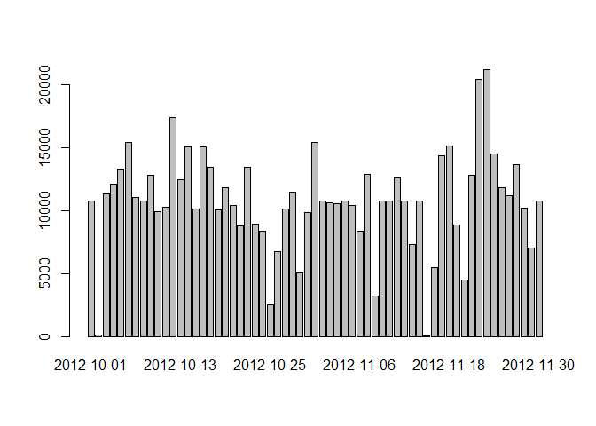
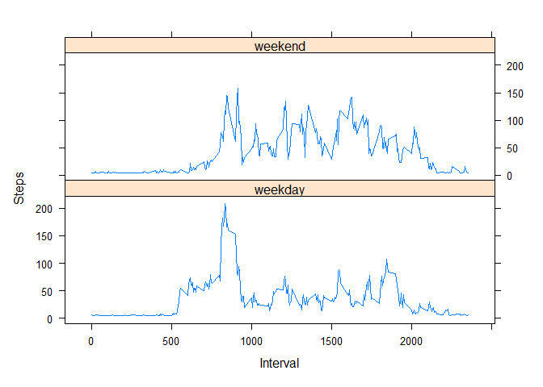

## Loading and preprocessing the data

Load the activity data and save the date in Date format


```r
activity <- read.csv(unzip("activity.zip"))
activity$date <- as.Date(activity$date)
```

## What is mean total number of steps taken per day?

See how many days there are


```r
length(unique(activity$date))
```

```
## [1] 61
```

1.  Calculate the total number of steps taken per day


```r
StepsPerDay <- with(activity, tapply(steps, date, sum, na.rm = FALSE))
```

Quick check that we have 61 values (for the 61 days)


```r
length(StepsPerDay)
```

```
## [1] 61
```

2.  Make a histogram of the total number of steps taken each day


```r
barplot(StepsPerDay)
```

<!-- -->

3.  Calculate and report the mean and median of the total number of steps taken per day

-   Mean


```r
mean(StepsPerDay, na.rm = TRUE)
```

```
## [1] 10766.19
```

-   Median


```r
median(StepsPerDay, na.rm = TRUE)
```

```
## [1] 10765
```

## What is the average daily activity pattern?

1.  Make a time series plot (i.e. type = "l") of the 5-minute interval (x-axis) and the average number of steps taken, averaged across all days (y-axis)


```r
# calculate average steps per interval
AvgStepsPerInterval <- aggregate(list(steps = activity$steps), list(interval = activity$interval), mean, na.rm = TRUE)
# plot
plot(AvgStepsPerInterval, type = "l", xlab = "Time Interval", ylab= "Average Steps")
```

<!-- -->

###### Note: Got help from here <https://www.r-bloggers.com/2011/10/simple-time-series-plot-using-r-part-2/>

2.  Which 5-minute interval, on average across all the days in the dataset, contains the maximum number of steps?


```r
maxSteps <- max(AvgStepsPerInterval$steps)
AvgStepsPerInterval[which(AvgStepsPerInterval$steps == maxSteps), ]
```

```
##     interval    steps
## 104      835 206.1698
```

## Imputing missing values

1.  Calculate and report the total number of missing values in the dataset (i.e. the total number of rows with NAs)


```r
sum(is.na(activity$steps))
```

```
## [1] 2304
```

2.  Devise a strategy for filling in all of the missing values in the dataset. The strategy does not need to be sophisticated. For example, you could use the mean/median for that day, or the mean for that 5-minute interval, etc.

    Strategy: Replace the NAs with the average of steps

3.  Create a new dataset that is equal to the original dataset but with the missing data filled in.


```r
newActivity <- activity
newActivity$steps[is.na(newActivity$steps)] <- mean(newActivity$steps, na.rm = TRUE)
```

###### Note: Got help from here <https://www.journaldev.com/39695/replace-in-r>

4.  Make a histogram of the total number of steps taken each day and Calculate and report the mean and median total number of steps taken per day. Do these values differ from the estimates from the first part of the assignment? What is the impact of imputing missing data on the estimates of the total daily number of steps?

-   Make a histogram of the total number of steps taken each day


```r
newStepsPerDay <- with(newActivity, tapply(steps, date, sum, na.rm = FALSE))
barplot(newStepsPerDay)
```

<!-- -->

-   Calculate and report the mean and median total number of steps taken per day.

    -   Mean

        
        ```r
                mean(newStepsPerDay)
        ```
        
        ```
        ## [1] 10766.19
        ```

    -   Median

        
        ```r
        median(newStepsPerDay)
        ```
        
        ```
        ## [1] 10766.19
        ```

```{=html}
<!-- -->
```
-   Do these values differ from the estimates from the first part of the assignment?  
The mean is the same, the median is changed compared to the original dataset.  
To remember, here are the mean and median from the original dataset (without replacement of NA)

```r
mean(StepsPerDay, na.rm = TRUE)
```

```
## [1] 10766.19
```

```r
median(StepsPerDay, na.rm = TRUE)
```

```
## [1] 10765
```

-   What is the impact of imputing missing data on the estimates of the total daily number of steps?  
Imputing missing data gives higher values for the estimates of the total daily number of steps.

## Are there differences in activity patterns between weekdays and weekends?
1. Create a new factor variable in the dataset with two levels – “weekday” and “weekend” indicating whether a given date is a weekday or weekend day.  
- First save date as weekday

```r
newActivity$date <- weekdays(newActivity$date, abbreviate = FALSE)
```
- Quickly see date

```r
table(newActivity$date)
```

```
## 
##    Friday    Monday  Saturday    Sunday  Thursday   Tuesday Wednesday 
##      2592      2592      2304      2304      2592      2592      2592
```
- Then create the new variable

```r
newActivity$day = ifelse(newActivity$date %in% c("Saturday", "Sunday"), "weekend", "weekday")
```
- See the new variable

```r
table(newActivity$day)
```

```
## 
## weekday weekend 
##   12960    4608
```

2. Make a panel plot containing a time series plot (i.e. type = "l") of the 5-minute interval (x-axis) and the average number of steps taken, averaged across all weekday days or weekend days (y-axis). See the README file in the GitHub repository to see an example of what this plot should look like using simulated data.
- First average steps by interval and by day

```r
AvgStepsByDay <- aggregate(newActivity$steps, list(interval = newActivity$interval, 
                                       day = newActivity$day), mean)
```
- Then plot using lattice

```r
library(lattice)
xyplot(x ~ interval | day, AvgStepsByDay, layout=c(1,2), type = "l", ylab = "Steps", xlab = "Interval")
```

<!-- -->

It seems that on average, there is more activity in the weekend compared to weekdays, except for the beginning of the day, where the number of steps is higher on weekdays.


